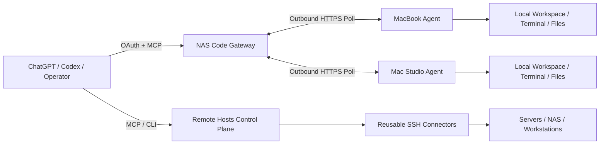

# Remote Hosts

**中文** | [English](README_EN.md)

Remote Hosts 是一套面向 AI Agent 与人类运维者的远程操作与代码协作平台。它把可复用的 SSH 控制面与独立的 ChatGPT 代码网关组合在一起，让 Agent 能够高效、安全、可恢复地操作你自己的多台电脑和服务器，而不需要为每一种产品、每一台机器重新设计一套工具。

项目重点不是“能不能执行命令”，而是四件事：**调用足够少、执行可恢复、权限边界明确、交付结果可验证**。长任务有持久状态，重试不会静默重复副作用，文件传输支持恢复，发布结果绑定固定源码输入，每台设备始终是显式目标，不会在失败时偷偷切换到另一台机器。

## 能做什么

### 远程主机控制面

- 统一管理主机、环境、访问路径与凭据绑定。
- macOS、Linux、Windows 上复用原生 `russh` 连接，并保留可选的 OpenSSH 兼容后端。
- 执行 POSIX / PowerShell 命令，支持持久 PTY、受限输出、脱敏与大输出产物。
- 通过 SFTP、framed exec channel 或已选定的 bastion PTY 做校验过的上传/下载。
- Workspace、PTY、操作、产物和幂等键按会话隔离，同时安全复用底层物理连接。
- 本地加密保存凭据，并维护基础设施拓扑、知识与实例间同步。

### ChatGPT 代码网关

`remote-hosts-code` 由 NAS 上的 OAuth/MCP Gateway 和各电脑上的出站 Agent 组成。Gateway 不直接暴露本机 operator API；每台设备都有自己的身份、授权根目录和运行能力。

0.5.0 已包含这些核心能力：

- 绑定设备的持久 Workspace，支持受限代码列表、搜索、批量读取和语法树符号范围。
- 带版本检查和本地 journal 的多文件精确编辑。
- **完整变更审查**：`code_diff` 可以纳入未被忽略的 untracked 文本/二进制文件，不再出现“核心目录没进 Git，但 diff 却是空的”这种误导。
- 持久终端、稳定输出游标，并把终端退出状态复制回原始 `operation_get`，减少多层轮询。
- 双向持久文件传输、4 MiB 检查点、显式 resume/cancel 与 SHA-256 校验。
- **Manifest 文件集同步 `files_sync`**：先 plan，只打包发生变化的文件内容，绑定每个目标文件的当前版本，恢复同一 manifest 时不会覆盖并发修改。
- **Workspace 事件接续**：按工作区保存有限的状态转换记录，支持断线后通过 cursor 补读，同时提供终端/传输摘要。
- **升级排空协议**：更新前停止领取新的执行/写入/传输任务，但状态读取、取消和回执补送继续工作；已有任务先自然排空，不粗暴中断。
- **结构化错误与恢复动作**：返回稳定的 `error_code / stage / outcome / recovery_action`，而不是只给一条模糊 `tool_failed`。
- 工具 schema 指纹与 Agent feature 上报，可以区分“服务器已支持”与“当前 ChatGPT 会话实际暴露了什么”。
- 可选 compact 文本响应，同时保留完整 structured content。

当前服务端目录包含 **19 个 code gateway 工具**。ChatGPT 某个已存在会话仍可能因为宿主缓存旧 schema 而只看到其中一部分，这种差异会被单独报告，不会被解释成服务器没有升级。

## 架构



传统 SSH 控制面与 ChatGPT 代码网关相互配合，但执行状态彼此独立；设备离线时不会自动把一个 Workspace 切到另一台电脑。

## 快速开始

### macOS 服务

```bash
scripts/remote-hosts-service install
scripts/remote-hosts-service status
```

本机管理界面：`http://127.0.0.1:8787/admin`

常用命令：

```bash
scripts/remote-hosts-service update
scripts/remote-hosts-service restart
scripts/remote-hosts-service logs
scripts/remote-hosts-service ui
scripts/remote-hosts-service skills
```

### Windows

```powershell
Set-ExecutionPolicy -Scope Process Bypass
.\remote-hosts-service.ps1 Install
.\remote-hosts-service.ps1 Status
```

完整说明见 [Windows 安装与运维](docs/windows.md)。

### ChatGPT Code Gateway

先阅读 [ChatGPT Code Gateway](docs/chatgpt-code-gateway.md)。正常协作流程是：

1. `devices_list`：明确选择授权设备，不做隐式 failover。
2. `workspace_open`：打开一次并复用设备绑定的 Workspace。
3. 路径未知时再搜索；路径和范围已知时直接批量读取。
4. 使用版本检查编辑，随后查看完整变更集。
5. 测试通过持久终端运行，观察原任务，不为“看结果”重新执行命令。
6. 单文件使用持久传输，多文件成果优先使用 `files_sync`。
7. 对话重连后通过 `workspace_context` 和事件 cursor 继续，而不是重新扫描全部日志。

## 可靠性模型

Remote Hosts 明确区分：**请求已接收、执行已完成、版本已安装、进程已运行、现场验收已通过**。这些不是同一件事。

- 写操作使用稳定幂等键和持久本地记录。
- 进程崩溃后，结果未知的任意 shell 命令不会自动重跑。
- 文件恢复沿用原 `operation_id` 和已经确认的检查点身份。
- 多文件普通写入保证“每个文件原子”，不虚构整个文件系统级全局原子事务；部分失败会准确返回已完成项。
- 发布前创建固定源码快照，测试回执和最终产物必须来自同一输入身份。
- 协议需要时先升级 Gateway，再升级 Agent。
- Agent 更新使用 maintenance lease、稳定就绪检查和按目标独立验收；一台机器忙不应阻塞另一台已经健康的机器完成发布。

## 当前版本

0.5.0 固定源码快照通过 **338 项测试：230 Rust + 108 Python，0 失败**，并通过格式检查、严格 Clippy、workspace check 和 macOS/Linux 两平台 release 构建。

当前最后核对状态：

- NAS Gateway：**0.5.0**。
- MacBook-M2-Max：**0.5.0**。
- Mac Studio：**0.5.0**。

首次自动标准验收没有真正运行：发布器把语义版本直接放进 `run-id`，生成了 `release-0.5.0-...`，而验收器只允许字母数字和连字符。这个 bug 已修成 `release-0-5-0-...` 并增加回归测试。之后从当前对话补跑完整验收组合命令时，宿主在执行前进行了安全拦截，因此文档仍准确区分“**三端正在运行 0.5.0**”与“**0.5.0 完整自动验收已通过**”。

详见 [0.5.0 发布证据](docs/releases/0.5.0/RELEASE.md)。

## 开发与发布

仓库固定 Rust `1.94.1`。

```bash
cargo fmt --all
cargo test --workspace
cargo check --workspace
cargo clippy --workspace --all-targets -- -D warnings
```

Code Gateway 使用固定输入快照发布：

```bash
python3 scripts/source_snapshot.py --destination target/source-snapshots/<id>
python3 scripts/release-code.py \
  --snapshot target/source-snapshots/<id> \
  --report target/<iteration>/pipeline.json
```

如果某个构建/发布观察器超时，不要因为“没看到结果”就重新执行副作用；先读取原 report、operation 或 updater receipt。

## 仓库结构

```text
crates/
  remote-hosts-domain       公共实体与状态类型
  remote-hosts-core         策略、监督、脱敏与传输抽象
  remote-hosts-vault        本地加密凭据
  remote-hosts-db           SQLx migrations 与 repositories
  remote-hosts-connector    SSH transport、连接池、PTY 与 worker
  remote-hosts-api          HTTP API 与管理界面
  remote-hosts-mcp          主 MCP 服务与 schema
  remote-hosts-sync         实例同步
  remote-hosts-cli          服务与管理 CLI
  remote-hosts-code         ChatGPT Code Gateway 与本机 Agent
migrations/                 数据库迁移
scripts/                    安装、升级、验证与发布自动化
skills/                     仓库维护的 Agent Skills
docs/                       架构、运维、发布证据和产品问题清单
```

## 文档

建议从 [文档索引](docs/README.md) 开始。

- [架构与运行模型](docs/architecture-and-runtime.md)
- [部署与运维](docs/deployment-and-operations.md)
- [ChatGPT Code Gateway](docs/chatgpt-code-gateway.md)
- [产品问题清单](docs/product/BACKLOG.md)
- [持续迭代流程](docs/product/README.md)
- [0.5.0 路线图](docs/product/ROADMAP-0.5.0.md)
- [0.5.0 发布证据](docs/releases/0.5.0/RELEASE.md)
- [Windows 安装与运维](docs/windows.md)

## 安全边界

凭据在本地数据库加密保存，凭据工具不会返回明文。Code Gateway 的 OAuth scope 与设备权限独立检查。Workspace 文件工具受授权根目录约束；**终端执行拥有本地用户的操作系统权限，并不是文件系统沙箱**。输出脱敏只是 best effort，不能替代“不把密码放进命令”。临时文件下载 URL 是短期 bearer capability，应视为私密信息。

Remote Hosts 不绕过 ChatGPT 或操作系统自身的安全/权限机制。宿主工具审批、管理员权限、Full Disk Access 等仍然属于外部边界。
