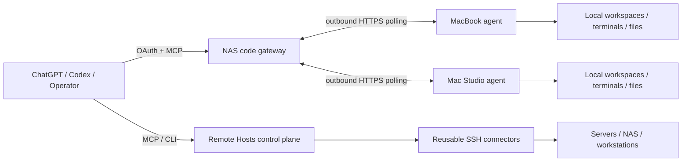

# Remote Hosts

[中文 README](README.md) | **English**

Remote Hosts is a remote-operation and code-collaboration platform designed for AI agents and human operators. It combines a reusable SSH control plane with a separate, authenticated ChatGPT code gateway so an agent can work across your own computers without turning every product or device into a bespoke integration.

The project optimizes for four things: **low interaction cost, recoverable execution, explicit isolation, and verifiable delivery**. Long-running work is durable, retries do not silently replay side effects, file transfers are resumable, release evidence is tied to fixed source inputs, and each device remains an explicit target rather than an automatic failover destination.

## What it provides

### Remote operation plane

- Canonical host inventory, environments, routes and credential bindings.
- Reused native `russh` connections on macOS, Linux and Windows, with an optional OpenSSH compatibility backend.
- POSIX and PowerShell execution, persistent PTYs, bounded/redacted output and artifacts.
- Verified uploads/downloads over SFTP, framed exec channels or a selected bastion PTY.
- Per-conversation Workspace, PTY, operation, artifact and idempotency isolation while physical SSH transports are shared safely.
- Local encrypted credential storage, topology/knowledge persistence and peer synchronization.

### ChatGPT code gateway

The `remote-hosts-code` service runs a NAS-side OAuth/MCP gateway plus outbound agents on selected computers. The gateway never exposes a local operator API directly; each device owns its own credential and permitted roots.

Current 0.7.1 capabilities include:

- Version-bound workspaces, bounded code listing/search/reads and syntax-tree symbol ranges.
- Optimistic, journaled multi-file text edits with conflict detection.
- **Complete change review** that can include non-ignored untracked text/binary files instead of returning an empty Git diff.
- Durable terminals with stable output cursors and status replication into `operation_get`.
- Durable inbound/outbound file transfer, checkpoint recovery, explicit resume/cancel and SHA-256 verification.
- **Manifested one-way file-set synchronization (`files_sync`)**: preview a file set, transfer only changed payloads, preserve per-file target versions, and resume the same manifest without overwriting concurrent edits.
- **Workspace event handoff**: bounded per-workspace state transitions with replay cursors, plus terminal/transfer summaries for reconnecting conversations.
- **Maintenance drain protocol** for upgrades: stop admitting new execution while status/control/result delivery remains available; existing work is allowed to drain instead of being killed.
- Stable structured diagnostics with an error code, stage, outcome and recovery action rather than opaque `tool_failed` text.
- **Durable change sets and safe recovery**: multi-file edits retain before/after versions and `change_resume` continues only files whose state is still provably safe.
- **Explicit workspace GC**: preview is bound to a candidate fingerprint before apply; active work and small idempotency records remain protected.
- **Negotiated large-file capability**: the default stays 64 MiB, while 0.7+ agents can explicitly negotiate requests up to 256 MiB with a 256 MiB local free-space reserve. Source authorization reports available / expired / required states.
- Capability/schema fingerprints so clients can detect that their cached tool catalog is stale.
- Optional compact text responses while structured content remains complete.

The server currently advertises 21 code-gateway tools. A ChatGPT conversation can still expose fewer tools when the host keeps an older approved schema snapshot; server capability and host-visible capability are intentionally reported separately.

## Architecture



The classic SSH control plane and the code gateway are related but independent. They do not share execution state or silently substitute one device for another.

## Quick start

### macOS service

```bash
scripts/remote-hosts-service install
scripts/remote-hosts-service status
```

Open the local console at `http://127.0.0.1:8787/admin`.

Common operations:

```bash
scripts/remote-hosts-service update
scripts/remote-hosts-service restart
scripts/remote-hosts-service logs
scripts/remote-hosts-service ui
scripts/remote-hosts-service skills
```

### Windows

```powershell
Set-ExecutionPolicy -Scope Process Bypass
.\remote-hosts-service.ps1 Install
.\remote-hosts-service.ps1 Status
```

See [Windows Installation and Operations](docs/windows.md) for Task Scheduler services, paths and troubleshooting.

### ChatGPT code gateway

Start with [ChatGPT Code Gateway](docs/chatgpt-code-gateway.md). The normal flow is:

1. `devices_list` to choose an explicitly authorized device.
2. `workspace_open` once, then reuse that device-bound workspace.
3. Search only when the path/range is unknown; batch known reads.
4. Apply version-checked edits and inspect the complete change review.
5. Run tests in a durable terminal and observe the original operation instead of rerunning it.
6. Use durable file transfer or `files_sync` for artifacts and multi-file deliveries.
7. Use `workspace_context` and event cursors to continue after reconnecting.

## Reliability model

Remote Hosts treats an acknowledgement, an execution result, an installation, and an acceptance result as different facts.

- Mutating requests use stable idempotency keys and durable local records.
- After an uncertain crash, arbitrary commands are **not** replayed automatically.
- File transfer recovery reuses the original operation and verified checkpoint identity.
- Multi-file writes are per-file atomic; a partial batch reports exactly what was applied and never promises a fake filesystem-wide transaction.
- Release inputs are captured into a fixed source snapshot; tests and artifacts must match that snapshot.
- Gateway upgrades happen before agents when protocol compatibility requires it.
- Agent upgrades use a maintenance lease, stable readiness checks and per-target acceptance. One busy device must not prevent a healthy peer from completing its own release path.

## Current release

The validated 0.7.1 source snapshot passed **348 tests (238 Rust + 110 Python, 0 failed)** plus formatting, strict Clippy, workspace checks and both release builds. The NAS gateway, MacBook and Mac Studio are online and report **0.7.1**.

The live rollout found a real cross-version receiver bug: an older 0.6 agent could write chunk bytes successfully, then receive permanent HTTP 409 when durable offset persistence failed. 0.7.1 maps database/IO persistence failures to retryable 5xx while retaining 409 for true integrity conflicts. A subsequent **9,089,298-byte** live export retried once, resumed from the **4 MiB checkpoint**, reached the exact SHA-256, and was then imported successfully to Studio.

Both Macs passed native code create/read/symbol/idempotent-edit/terminal/cleanup checks. The automated acceptance script also had an obsolete whole-object idempotency assertion that included live `operation_lifecycle`; that harness bug is fixed and **112 Python tests** pass. A full wrapper rerun from this conversation was blocked by the host before execution, so it is not counted as passed. This conversation's host-visible `file_*` schema still caps requests at 64 MiB, leaving a native host **>64 MiB live round trip** as a separate next gate.

See [0.7.1 release evidence](docs/releases/0.7.1/RELEASE.md).

## Development and release

The workspace pins Rust `1.94.1`.

```bash
cargo fmt --all
cargo test --workspace
cargo check --workspace
cargo clippy --workspace --all-targets -- -D warnings
```

Code-gateway releases use fixed-input snapshots:

```bash
python3 scripts/source_snapshot.py --destination target/source-snapshots/<id>
python3 scripts/release-code.py --snapshot target/source-snapshots/<id> --report target/<iteration>/pipeline.json
```

Do not restart an unknown build or publication action merely because its observer timed out. Inspect the original report/operation first.

## Repository layout

```text
crates/
  remote-hosts-domain       Shared entities and state types
  remote-hosts-core         Policy, supervision, redaction and transport traits
  remote-hosts-vault        Encrypted local credentials
  remote-hosts-db           SQLx migrations and repositories
  remote-hosts-connector    SSH transports, pools, PTYs and workers
  remote-hosts-api          HTTP API and admin console
  remote-hosts-mcp          Main MCP server and request schemas
  remote-hosts-sync         Peer synchronization
  remote-hosts-cli          Service/admin CLI
  remote-hosts-code         ChatGPT code gateway and local agent
migrations/                 Database schema migrations
scripts/                    Install, upgrade, validation and release automation
skills/                     Repository-owned agent skills
docs/                       Architecture, operations, releases and product backlog
```

## Documentation

Start from [Documentation Index](docs/README.md). Important references:

- [Architecture and Runtime](docs/architecture-and-runtime.md)
- [Deployment and Operations](docs/deployment-and-operations.md)
- [ChatGPT Code Gateway](docs/chatgpt-code-gateway.md)
- [Product Backlog](docs/product/BACKLOG.md)
- [Product Workflow](docs/product/README.md)
- [0.5.0 Roadmap](docs/product/ROADMAP-0.5.0.md)
- [0.7.1 Release Evidence](docs/releases/0.7.1/RELEASE.md)
- [Windows Installation and Operations](docs/windows.md)

## Security summary

Credentials are encrypted locally and plaintext secrets are never returned by credential tools. Code gateway OAuth scopes and device permissions are checked independently. Workspace file tools are capability-confined to authorized roots, while terminal execution intentionally has the local user's OS authority and therefore is **not** a filesystem sandbox. Output redaction is best effort, not a substitute for keeping secrets out of commands. File URLs are short-lived bearer capabilities and should be treated as private.

Remote Hosts does not bypass ChatGPT or operating-system safety/permission decisions. Host-visible tool approval, OS elevation, Full Disk Access and similar controls remain external boundaries.
