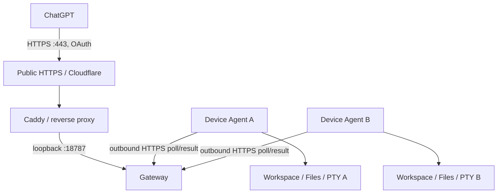

# ChatGPT unified code gateway

**2026-09-12 release status:** the latest immutable packaged release is **0.9.0**. Its fixed-source pipeline passed **372 tests (239 Rust + 133 Python, 0 failures)**, strict format/Clippy/workspace gates, and both macOS ARM64 and Linux x86_64-musl release builds. The immutable package manifest SHA-256 is `8e40977a4fc83d6999c89bcccf70bae160b5aca58cf89f5f82b4302ba4b9f5e2`.

Repository HEAD, generated package, installed version, running process and live acceptance are intentionally separate states. `main` may contain post-0.9.0 changes that have not yet been repackaged. This public document records only repository/release facts. A specific deployment's installed/running/accepted state belongs to its private ops/runtime system. See [Repository Content Model](repository-content-model.md).

0.9.0 adds stable macOS updater/code identity foundations, native `russh` PTY resize/signal delivery, pooled port forwarding, Linux systemd user-service support, real-SSHD regressions including a verified 1 GiB transfer, and a two-process MCP regression proving Workspace/PTY isolation plus write-lease handoff over one pooled SSH transport.

Remote Hosts now includes the `remote-hosts-code` executable with two roles:

- `gateway`: single-owner OAuth 2.1 / PKCE authorization, Streamable HTTP MCP,
  device discovery, and durable request routing on the NAS.
- `agent`: outbound authenticated polling from each computer, capability-confined
  file tools, optimistic edits, local shell/PTY execution, and durable receipts.

This runs alongside the existing Remote Hosts operator API and SSH connector.
It does not expose the unauthenticated operator API or share its database. A
device is an installation identity; an SSH host in the existing inventory is
not automatically an authorized code device.

## Network and identity



A deployment exposes an HTTPS origin such as `https://mcp.example.com`; its MCP resource is
`https://mcp.example.com/mcp`. The public edge may be a direct reverse proxy, Cloudflare Proxy with
an Origin Rule, or Cloudflare Tunnel. The concrete DNS names, ports and provider IDs are deployment
profile data and are intentionally not recorded in this public document. See
[Code Gateway 从零部署与新设备接入](code-gateway-deployment.md) for the reference topologies and a sanitized real-world deployment case study.

The login response uses `Referrer-Policy: same-origin` so browser form POSTs retain a valid Origin,
and CSP permits form redirects to `https://chatgpt.com`. The gateway checks the exact registered
callback before issuing a code.

The gateway binds loopback only. Each computer has its own randomly generated
device credential; the gateway stores only its hash. Device identity cannot be
chosen by a request: the credential selects the device. One active device session
is allowed; replacing a dead session waits for its 45-second lease to expire.
The worker polls for up to 20 seconds and immediately returns durable results.

`workspace_open` explicitly selects a device and canonical directory. Subsequent
tools use an opaque workspace ID that binds both. The agent verifies this binding
again and rejects another device's workspace or another workspace's terminal.
Offline devices never trigger failover to another computer.

The current product is deliberately **one personal owner with multiple devices**.
It is not a multi-tenant service. OAuth scopes (`code:read`, `code:write`,
`terminal:exec`) and per-device permissions are independently checked. The OAuth
client uses authorization code + S256 PKCE and restricted dynamic registration;
redirect URIs are an exact allowlist. Codes are single use, access tokens expire
after one hour, refresh tokens rotate and expire after 30 days, and refresh-token
replay revokes the token family. Authentication endpoints are rate limited.

## Installation

如果是第一次搭建 Gateway、需要配置 Cloudflare/公网入口，或者要向现有 Gateway 增加 Linux/macOS/Windows 设备，先按 [Code Gateway 从零部署与新设备接入](code-gateway-deployment.md) 操作。本节只保留通用协议与产品行为，不记录维护者自己的生产实例拓扑。

Build using the workspace Rust toolchain:

```sh
cargo test -p remote-hosts-code
cargo clippy -p remote-hosts-code --all-targets -- -D warnings
cargo build -p remote-hosts-code --release
cargo zigbuild -p remote-hosts-code --release --target x86_64-unknown-linux-musl
```

Generate gateway configuration outside the repository, then enroll each device:

```sh
remote-hosts-code init-gateway \
  --config /private/setup/gateway.json \
  --public-url https://mcp.example.com \
  --state-dir /var/lib/remote-hosts-code \
  --password-file /private/setup/gateway-login-password.txt

remote-hosts-code enroll \
  --gateway-config /private/setup/gateway.json \
  --agent-config /private/setup/device-a-agent.json \
  --name Device-A \
  --state-dir /home/YOUR_USER/.local/share/remote-hosts-code/state \
  --root /home/YOUR_USER/Workspace \
  --allow-write --allow-exec \
  --shell /bin/bash
```

Each invocation of `enroll` creates a new device UUID and credential. Repeat with a different config
filename and device name for every machine. Do not copy an existing device config to another
computer. All configuration and login-password files must be private; agent state must be outside
exposed roots. Platform-specific service examples belong in generic deployment templates, while real
UID/GID, NAS paths, DNS and device inventory belong in the private deployment profile.

On macOS, stage the native binary and that computer's private configuration, then run:

```sh
python3 scripts/install-code-agent.py \
  --binary ~/.local/share/remote-hosts-code/bin/remote-hosts-code \
  --config ~/.local/share/remote-hosts-code/agent.json
```

The per-user LaunchAgent is `com.remote-hosts.code-agent`. It does not restart the
existing Remote Hosts services. It requires the user login session; sleep or
logout makes the device unavailable. The script refuses to restart an already
loaded agent. Inspect and finish/cancel its own active terminals before updates.

## Connect ChatGPT

Enable developer mode and add a remote MCP app with the public `/mcp` URL and
OAuth authentication. Choose dynamic client registration if prompted. Verify
that Authorization Server Base is `https://mcp.example.com` (the issuer),
while Resource remains `https://mcp.example.com/mcp`. The ChatGPT form may
populate the former with the resource URL; correct it before creating. The gateway
advertises RFC 9207 issuer identification and permits the documented stable
redirect `https://chatgpt.com/connector_platform_oauth_redirect`. If the app setup
shows a different callback URI, add that **exact URI** to `redirect_uris` and
restart the gateway; do not widen it to a wildcard.

The OAuth login page accepts the generated gateway owner password and explicitly
describes terminal authority. Keep the password in a private local file or your
password manager; never paste it into chat or terminal tools. ChatGPT controls its
own write confirmation UX. `workspace_open`, edits and execution are honestly
marked mutating; read-only hints are not used to bypass confirmation.

Official requirements:
- https://developers.openai.com/api/docs/guides/developer-mode
- https://developers.openai.com/plugins/build/auth

## Code workflow

1. `devices_list`: discover authorized online devices and permitted roots.
2. `workspace_open`: choose one device and project; save the workspace ID.
3. When paths or locations are unknown, use `code_list` / `code_search` with bounded pages.
4. When declaration ranges are unknown, use `code_symbols` for Rust, Python,
   JavaScript and TypeScript/TSX; other languages use a labeled lexical outline.
5. `code_read`: batch explicit line ranges across up to 20 files and save versions.
   Skip discovery calls when the exact path and range are already known; reuse
   the current conversation's workspace rather than reopening it per operation.
6. `code_apply_edits`: exact replacements, unified patches, creates or deletes.
7. `code_diff`: inspect staged/unstaged changes and, in 0.5.0, optionally include bounded non-ignored untracked text/binary entries so an untracked source tree cannot look like an empty diff.
8. `terminal_exec`, `terminal_read`, `terminal_input`, `terminal_cancel`: run tests and interact with the same terminal rather than rerunning commands. Terminal completion can also be replicated into the original operation observation; output still uses its independent byte cursor.
9. `workspace_context`: recover bounded terminal/transfer summaries and workspace-scoped event cursors after reconnecting.
10. `file_upload` / `file_download`: use durable, verified single-file transfer with explicit resume/cancel for suspended work.
11. `files_sync` (0.5.0 server catalog): plan a version-bound file set and publish only changed payloads from a verified manifest bundle. It never deletes extra target files by default.

A host conversation may not immediately expose every new server tool. Always compare the gateway catalog/capabilities with the tools actually loaded by the host before assuming a newly deployed action is callable.

Search uses Rust's ignore/glob/regex libraries locally rather than transferring
the repository. `.gitignore` is respected unless explicitly overridden; `.git`
internals are excluded from broad file enumeration. UTF-8 text files are limited
to 8 MiB; binary files produce an explicit error. Reads normally return at most
16 KB of text (configurable to 64 KB). Oversized single lines are reported rather
than silently skipped. File versions are SHA-256 hashes of exact bytes. Search
pages observe live files, so repeat the query after edits.

Edits require `expected_version`; creating a file requires `"absent"`. Exact old
text must match once; overlapping replacements are rejected. Every file is
preflighted before writes. Individual file replacement uses a same-directory
temporary file and rename, preserves permissions, and uses directory capabilities
to prevent symlink/path traversal outside the workspace. New files can create
relative parent directories. All changes are journaled in private local state.
Multi-file edits are **not** a filesystem-wide transaction: a later failure
reports completed paths and preserves a recovery journal. External editors do not
participate in the agent's write lock; version checks minimize conflicting writes
but are not a universal filesystem compare-and-swap primitive.

Semantic reference search / compiler-aware rename via LSP is not included. The
syntax tree provides reliable structural ranges without requiring an IDE or
language server on every device.

## Execution and recovery

Shell execution runs with the current local user's authority. **Code root limits
do not sandbox arbitrary terminal commands.** Enabling `terminal:exec` permits
commands outside project roots, subject to operating-system permissions. Full
Disk Access, administrator elevation and similar OS permissions remain external.
The gateway never classifies a shell command as read-only merely from its name.

In the reviewed source, `pty=false` (the default) uses real pipes with stdin EOF
and a single combined stdout/stderr stream. `terminal_input` is rejected for
these commands; choose `pty=true` when interactive input is required. Only
interactive terminals allocate a PTY. Noninteractive commands default to
`TERM=dumb`, `NO_COLOR=1`, `CLICOLOR=0`, and non-paging output. A command or shell
profile can explicitly override these preferences. Login shells still load the
user's shell configuration; LaunchAgent PATH is explicit.

Execution returns immediately with the same durable terminal ID. There are eight
live terminal slots per agent runtime; raw capture and persisted output are each
capped at 8 MiB. Incremental reads default to 16 KB, and timeouts are at most two
hours. The reader continues draining after the capture limit so a full pipe does
not stall the command. Cancel and timeout target the Unix process group;
finalization cannot overwrite an acknowledged cancellation. Detached subprocesses
which deliberately create a new session are outside this process-group guarantee.
Their open output handles can also outlive the tracked shell; drain timeout seals
the published log with an explicit error, but does not prove every descendant or
blocked reader thread has been reclaimed.

New captures decode UTF-8 and redact the known device credential and supported
credential patterns incrementally **before** writing their private log. Completed
prefixes are append-only, so `terminal_read` seeks to a stable sanitized byte
cursor instead of rereading and retranslating the whole log. An incomplete UTF-8
character or possible device-credential prefix is temporarily withheld. Ordinary
prompts do not need a newline to become visible. Never supply credentials through
terminal tools; pattern redaction remains best effort, not an output sandbox.

`has_more` indicates buffered output beyond this page, not whether the process is
running. Check `terminal.state`, `exit_code`, and `output_complete`; the latter
means capture is closed, not necessarily complete in content. Also check
`output_truncated` and `output_error`. Follow the returned cursor, not the length
of a reconstructed display string. The response identifies the stream as
`combined` and the new cursor format as `sanitized_utf8_v1`.

Old logs remain readable through the explicitly labeled `legacy_transformed`
compatibility path. They retain their original full-log redaction/cursor behavior;
historical raw files are not silently migrated or claimed sanitized at rest.
Missing logs return a retrieval error rather than a false empty-output success.
These changes require deploying the new agent; editing source does not upgrade
the active web connection.

Gateway requests persist before dispatch. Local operations persist an execution
marker before work and a result before transmission. Reusing an idempotency key
with different arguments is rejected. Network delivery can repeat a request but
the device returns its original result. After a process crash, a marked operation
without a result becomes `outcome_unknown`; it is never silently re-executed.
Inspect the local journal/files/processes before a deliberate new operation.

Gateway HTTP is stateless MCP; durable workspaces and operation IDs survive
HTTP reconnects. A gateway restart may require reconnecting the device session,
but does not rerun completed work. Agent restart loses live PTY handles and marks
them `runtime_lost`; it cannot restore a terminal from a PID. Gateway state and
device state must be backed up separately and never cloned as another device's
live identity. Removing a device from gateway config and restarting revokes it.

Stored tool requests, edit journals, and terminal artifacts may contain private
code or command output. State directories are mode `0700`, credentials are not
logged, and terminal responses redact recognized credential patterns and the
device token. Pattern redaction is not a guarantee against intentional secret
output. Expired OAuth data can be pruned without deleting active work; historical
operation and artifact retention requires an explicit operator policy and is not
automatically destructive.

## macOS stable code identity and upgrade authorization

Release 0.9.0 migrates the macOS code agent away from ad-hoc signing. Ad-hoc signatures have a
designated requirement tied to one concrete binary, so replacing the executable can make macOS
privacy and code-signing policy treat the next build as a different program. The 0.9.0 updater
creates one private, per-host Remote Hosts code-signing identity under
`~/.local/share/remote-hosts-code/signing`, keeps the signing key local, and signs only a verified
install copy. The immutable release artifact and its published checksum are never rewritten.

The installed agent uses the stable identifier `com.remote-hosts.code-agent` and an explicit
designated requirement bound to the persistent certificate fingerprint. Trust is scoped to the
macOS `codeSign` policy. The first migration may therefore require one logged-in-user confirmation
on each Mac; an unattended timeout remains `authorization_required` and does not restart or replace
the active agent. After that one migration, later releases reuse the same certificate, identifier,
designated requirement, binary path, launchd agent label, updater label
`com.remote-hosts.code-upgrade`, and stable updater runner path. A release is not accepted when the
reported installed signing identity differs from the per-host identity.

Do not regenerate a partially present identity to escape an authorization problem. A missing key,
certificate, or fingerprint mismatch is recovery work, not an invitation to mint a new identity,
because changing the signing identity would recreate the very permission churn this mechanism is
intended to eliminate.

## September 2026 review changes (source; deployment is separate)

The 2026-09-09 review replaces fixed 250 ms job / 100 ms result polling with
per-device notifications and a one-second durable-state recovery check. Jobs and
receipts remain committed before notification; a missed notification or gateway
restart does not replace the durable queue. Device-session lease acquisition is
now an atomic conditional database update. Result receipts reject unknown jobs,
undispatched jobs, wrong-device jobs and conflicting replays; exact replay remains
successful. Gateway and agent both validate the fixed tool catalog's nested
argument types, required fields, enum values and bounds.

Search snippets now reserve the matching text before surrounding context and
window oversized lines around the hit. `line_byte_offset` identifies a windowed
line; `match_truncated` is explicit when the match itself exceeds the byte budget.
Text edits reject NUL bytes during all-file preflight. File-list cursors use
checked bounds without integer-overflow panics. At that review checkpoint the
tool count remained 13. The second review added true noninteractive pipes,
append-only sanitized output and explicit capture status without changing that
interface.

Release 0.2.0 added two binary transfer tools, bringing the catalog to 15, and was
subsequently deployed by the user's Codex. It uses workspace/device authorization
independent of the older SSH/SFTP/MinIO identity model. Input uses host file
parameters; output uses temporary HTTPS links and MCP resource links. The 64 MiB
limit remains. Candidate 0.3.0 keeps this interface and adds the execution and
recovery changes described at the top of this document. Source-test success is
not a 0.3.0 production deployment or native attachment acceptance receipt.

Review evidence, benchmark scope and the deployment checklist are recorded in
`docs/chatgpt-code-gateway-review-2026-09-09.md`. Do not infer running-binary
versions or live speedups from source-test results. Terminal follow-up evidence
is in `docs/chatgpt-code-gateway-terminal-review-2026-09-09.md`.

## Verification gates

Keep these distinct: source tests, artifact checksums, service startup, public
TLS/OAuth/MCP tests, two live devices, and an actual ChatGPT browser conversation.
Do not claim the final browser gate from a simulated MCP client alone.
