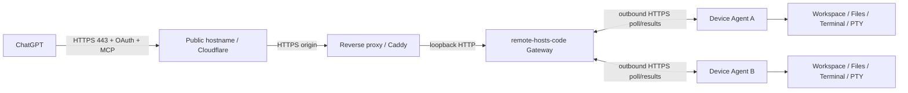
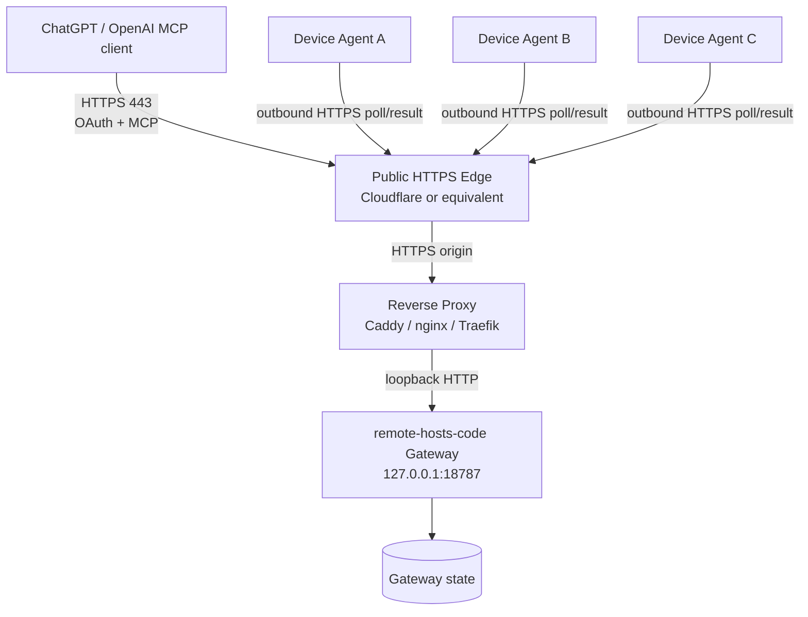
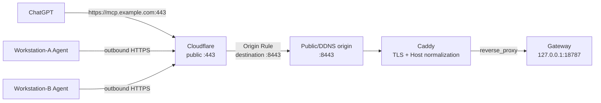

# ChatGPT Code Gateway 从零部署与新设备接入

本文面向两类读者：

1. **已经有一套 Remote Hosts Code Gateway，只想新增一台电脑或服务器。**
2. **第一次部署，准备自己搭建 Gateway、接入 ChatGPT，并持续加入多台设备。**

这里讨论的是 `remote-hosts-code` 这一条链路：ChatGPT 通过公网 HTTPS/OAuth/MCP 访问 Gateway，
每台设备运行本机 Agent 并主动向 Gateway 建立出站连接。它和仓库中的 SSH/operator control
plane 是两套独立运行状态，不要把 `remote-hosts-code agent`、`remote-hosts worker-daemon` 和
`scripts/remote-hosts-systemd-service` 混为一谈。

> 当前仓库发布版本为 0.9.0。0.9.0 的正式 release pipeline 已验证 macOS ARM64 和 Linux
> x86_64-musl `remote-hosts-code` 产物。Linux ARM64/aarch64 暂未作为正式二进制产物进入该
> release matrix，需要在目标机或可信构建机上从固定源码构建。

## 1. 先理解完整链路

最小可用拓扑包含三个角色：



部署顺序不要反：

1. **先有 Gateway。** Gateway 保存允许接入的设备身份、OAuth 状态和 MCP 路由。
2. **再让 Gateway 对 ChatGPT 公网可达。** 外部必须看到一个稳定的 HTTPS origin，例如
   `https://mcp.example.com`。
3. **再注册并启动每台设备上的 Agent。** Agent 主动连接 Gateway，因此设备本身通常不需要开放
   任何公网入站端口。
4. **最后在 ChatGPT 中创建 Developer-mode MCP app 并完成 OAuth。**

如果只是在现有 Gateway 上加新机器，从第 6 节开始即可。

### 1.1 推荐参考拓扑

对大多数个人/小团队部署，推荐把“公网入口”和“设备执行面”彻底分开：Gateway 是唯一需要被 ChatGPT 从公网访问的核心服务；所有工作站/服务器 Agent 都只主动出站连接 Gateway。



这套拓扑有几个重要性质：

- ChatGPT 只需要知道一个稳定的公网 HTTPS origin。
- Gateway 本体保持 loopback，不直接暴露公网监听。
- Agent 不需要公网 IP，也不需要给每台工作站开放 SSH/MCP 端口。
- Gateway state 与设备本地 state 各自持久化，设备离线不会导致 Workspace 隐式迁移到另一台机器。
- TLS、WAF、DNS、Tunnel/Origin Rule 都留在公网入口层，不侵入 Agent 协议。

根据 Gateway 所在网络，再从下面三种入口模式选择一个：

| 场景 | 推荐入口 | 典型路径 |
| --- | --- | --- |
| 家庭/NAS/办公室，有可用公网入站或端口映射 | Cloudflare Proxy + Origin Rule | `443 -> Cloudflare -> origin 8443 -> reverse proxy -> 18787` |
| CGNAT、无公网 IPv4、不能开放入站 | Cloudflare Tunnel | `443 -> Cloudflare -> Tunnel -> reverse proxy -> 18787` |
| 公网 VPS/云主机，本身即可稳定对外 | 直接 443 reverse proxy，可选 Cloudflare | `443 -> Caddy/nginx -> 18787` |

`8443` 不是协议要求，只是当标准 443 已被 NAS/其他服务占用时很实用的 origin 端口选择。真正的产品约束是：ChatGPT 看到稳定 HTTPS origin，Gateway 自身仍只监听受保护的本地地址。

## 2. 组件、端口与信任边界

| 组件 | 放在哪里 | 典型监听/连接 | 是否需要公网入站 |
| --- | --- | --- | --- |
| `remote-hosts-code gateway` | NAS/VPS/长期在线 Linux 服务器 | 默认 `127.0.0.1:18787` | 否，必须放在反向代理后 |
| Caddy / 其他反向代理 | Gateway 所在服务器或同网段入口 | HTTPS origin，例如 443/8443 | 视公网方案而定 |
| Cloudflare | 公网边缘 | 对 ChatGPT 暴露标准 HTTPS 443 | 是公网入口 |
| `remote-hosts-code agent` | 每台 Mac/Linux/Windows 设备 | 主动出站 HTTPS 到 Gateway | **不需要** |
| ChatGPT | OpenAI 托管侧 | 访问 `https://<hostname>/mcp` | 需要能访问你的公网域名 |

Gateway 源程序强制绑定 loopback。不要为了“省一层代理”把 Gateway 直接监听到 `0.0.0.0`。
公网 TLS、Host 归一化和安全响应头应该留在 Caddy/Cloudflare 这一层。

## 3. 部署前准备清单

### 3.1 Gateway 服务器

建议满足：

- 24x7 或至少在使用 ChatGPT 时长期在线。
- 能运行 Linux service/systemd，NAS 也可以。
- Gateway 状态目录持久化，不能放临时目录。
- 有一个你控制的域名，例如 `example.com`。
- 如果使用 Cloudflare Origin Rule：源站需要有公网可达路径，或者路由器能把公网端口转发到源站。
- 如果没有公网 IPv4、位于 CGNAT 后面或不想开放入站端口：改用 Cloudflare Tunnel。

### 3.2 新设备

每一台设备都需要：

- 能主动通过 HTTPS 访问 Gateway 公网域名。
- 一个专门用于运行 Agent 的本地用户，或者明确接受 Agent 使用当前用户权限。
- 至少一个授权 root，例如 `~/Workspace`。
- 私有 `agent.json` 和独立 state directory。
- **不能复制另一台设备的 `agent.json`。** 每台设备必须单独 enroll，获得独立 UUID/token。

### 3.3 ChatGPT

当前 ChatGPT Developer mode 支持把远程 MCP Server 添加为开发者 app，支持 streaming HTTP/SSE，
并支持 OAuth。Remote Hosts Code Gateway 使用 streaming HTTP + OAuth。按 OpenAI 当前文档，Developer
mode 可在 Web 端用于 Pro、Plus、Business、Enterprise 和 Education 账户；产品资格和菜单位置以后可能变化。
OpenAI 官方文档：

- Developer mode: <https://developers.openai.com/api/docs/guides/developer-mode>
- Plugin/MCP OAuth: <https://developers.openai.com/plugins/build/auth>

ChatGPT 产品 UI 会变化，以产品当前显示的回调 URI 和认证配置为准，不要根据旧截图硬编码。

## 4. 公网接入：ChatGPT 如何访问国内/家庭网络里的 Gateway

这是自部署最容易误解的一层。

ChatGPT 的 MCP 客户端运行在 OpenAI 侧，因此**不能只让你自己的浏览器能访问 Gateway**。公网域名必须
能从境外互联网稳定访问，OAuth discovery、登录、token exchange、`/mcp`、文件下载等路径都要走通。

Remote Hosts 当前生产拓扑使用 Cloudflare 作为公网前门。Cloudflare 有两种完全不同的用法：

### 4.1 方案 A：公网源站 + Cloudflare Proxy + Origin Rule 端口改写

适合：

- Gateway 所在网络有公网 IP / DDNS；
- 能把一个 HTTPS origin 端口从公网转到 Caddy；
- 希望外部始终使用标准 `https://mcp.example.com`，不在 URL 上暴露 `:8443`。

推荐流量：

```text
ChatGPT
  -> https://mcp.example.com:443
  -> Cloudflare proxy
  -> Origin Rule: destination port = 8443
  -> home/NAS public endpoint :8443
  -> Caddy
  -> http://127.0.0.1:18787
  -> remote-hosts-code gateway
```

Cloudflare 官方 Origin Rules 支持覆盖 destination port；Cloudflare 默认代理也支持 HTTPS 8443。
当前官方文档：

- <https://developers.cloudflare.com/rules/origin-rules/>
- <https://developers.cloudflare.com/rules/origin-rules/examples/change-port/>
- <https://developers.cloudflare.com/fundamentals/reference/network-ports/>

Cloudflare 侧建议：

1. 创建 `mcp.example.com` 的 A/AAAA/CNAME，开启橙云 Proxy。
2. 创建 Origin Rule，匹配 `http.host eq "mcp.example.com"`。
3. Destination Port 改写为 `8443`。
4. SSL/TLS 使用端到端 HTTPS，生产环境优先 Full (strict)。
5. 源站 8443 必须最终到达 Caddy 的 TLS listener。可以是路由器/NAT 的 `8443 -> 443`，也可以是
   Caddy 直接监听 8443，取决于你的基础设施；不要假设这两者是同一件事。

Cloudflare Origin Rule **不是穿透工具**。如果源站没有公网入站路径、在 CGNAT 后，单纯改端口没有用。

### 4.2 方案 B：Cloudflare Tunnel，无公网 IP / 无入站端口

适合：

- 中国大陆家庭宽带、办公室宽带或云环境没有稳定公网 IPv4；
- 位于 CGNAT 后；
- 不想给 Gateway/NAS 开公网入站端口。

`cloudflared` 从源站主动向 Cloudflare 建立出站连接，公网不需要暴露源站 IP。Cloudflare 官方说明
Tunnel 不需要公网 IP，也不需要开放入站端口：

- <https://developers.cloudflare.com/tunnel/>
- <https://developers.cloudflare.com/tunnel/setup/>

需要注意：

- `cloudflared` 自身必须能稳定访问 Cloudflare；受限防火墙环境需要允许其出站连接，官方当前文档重点
  提到 7844/TCP+UDP。
- 对本项目，优先让 Tunnel 到达**本地反向代理/Caddy**，继续保留 Host 归一化、CSP、
  `Referrer-Policy` 等行为。
- 如果绕过 Caddy 直接把 Tunnel 指向 `127.0.0.1:18787`，必须显式复现正确的 HTTP Host 和安全头；
  Gateway 会校验公网 authority。没有做过这一层验证时不要把“Tunnel Healthy”误认为 OAuth/MCP 已经健康。
- Cloudflare Tunnel 只是网络入口，不替代 Remote Hosts 自己的 OAuth 和设备认证。

### 4.3 如何选择三种网络方案

优先按约束选，不要按“哪个配置看起来更高级”选：

- **有稳定公网入站，且 443 已被其他站点占用：** Cloudflare Proxy + Origin Rule 最自然，公网仍是 443，源站可走 8443。
- **没有公网入站或处于 CGNAT：** 直接选择 Tunnel，不要再叠 DDNS + 端口转发。
- **Gateway 本来就在公网 VPS：** 最简单的是反向代理直接监听 443；是否再加 Cloudflare 取决于 DNS、WAF、隐藏源站和运维偏好。
- **企业网络有自己的公网 LB/WAF：** 可以替代 Cloudflare，只要保留标准 HTTPS、正确 Host、OAuth metadata、长连接/streaming 行为和足够的超时。

### 4.4 中国大陆部署的现实注意事项

- “设备能访问 Gateway”与“ChatGPT 能访问 Gateway”是两件事，必须分别测试。
- DDNS 只解决 IP 变化，不解决 CGNAT、运营商封端口、跨境链路质量和 TLS。
- Cloudflare 免费/普通全球网络不等于 Cloudflare 中国大陆专有网络；不要把它描述成“中国加速服务”。
- 如果 origin 在国内，至少从境外网络独立验证 `/healthz`、OAuth metadata 和 `/mcp` 可达性。
- 不要暴露 Gateway 的 loopback 端口，也不要把整个 NAS 管理面板一起代理到同一个公网 hostname。

### 4.5 脱敏真实案例：家庭/NAS Gateway + Cloudflare

下面这个案例来自真实部署经验，但已经移除了真实域名、设备身份、账号、路径和实时状态；它是**架构案例，不是当前生产状态记录**。

背景约束：

- Gateway 放在家庭/NAS 一侧，希望长期在线；
- 同一入口已经承载其他 HTTPS 服务，不希望把 Code Gateway 直接暴露在标准 origin 443；
- ChatGPT 从公网访问时仍希望只看到标准 `https://mcp.example.com`；
- 两台以上工作站可能位于不同网络，它们都应主动出站，不开放各自的公网端口。

采用的结构：



关键经验：

1. **公网资源 URL 始终保持标准 443。** `:8443` 只存在于 Cloudflare 到 origin 的网络段，不进入 OAuth issuer/resource URL。
2. **Host 必须统一。** Caddy 转发到 loopback Gateway 时保持/归一化为公网 hostname，否则 Gateway 的 authority 校验会把请求拒绝。
3. **Gateway 不直接接公网。** 即使 origin 8443 可达，真正对外的是 Caddy/TLS 层，Gateway 仍在 `127.0.0.1:18787`。
4. **Agent 走与 ChatGPT 相同的公网 origin。** 不给 Agent 配置 LAN-only 地址，这样设备换网络时不需要改身份配置。
5. **端口映射与 Cloudflare Origin Rule 是两层。** Origin Rule 决定 Cloudflare 连源站哪个端口；路由器/NAT/Caddy 必须真的让该端口可达。
6. **如果以后失去公网入站，拓扑可以平滑换成 Tunnel。** Gateway 和 Agent 协议不需要因此改变，只替换公网入口层。

这个案例适合用来理解端口关系，但不应该复制任何维护者实例的域名、DDNS、账号或设备清单。

## 5. 从零部署一台 Gateway

下面以通用 Linux 为例。任何 NAS/Synology/VPS 的实际安装目录、service UID/GID、存储卷和反向代理路径都属于该实例的 private deployment profile；公共仓库只提供通用模板，不应把某一套生产环境的值当作默认值。

### 5.1 获取固定版本二进制

优先使用正式 release 产物；如果需要自行构建，固定到明确 commit/tag 后再构建：

```bash
cargo build -p remote-hosts-code --release --locked
```

Linux x86_64 可以使用 release pipeline 生成的 `x86_64-unknown-linux-musl` 产物。不要把 macOS
二进制传到 Linux，也不要在 ARM64 Linux 上运行 amd64 artifact。

安装示例：

```bash
sudo install -m 0755 remote-hosts-code /usr/local/bin/remote-hosts-code
remote-hosts-code --version
```

发布包有 manifest/SHA-256 时先校验 hash，再安装。

### 5.2 创建独立服务用户和目录

```bash
sudo useradd --system --home /var/lib/remote-hosts-code --shell /usr/sbin/nologin remote-hosts-code || true
sudo install -d -o remote-hosts-code -g remote-hosts-code -m 0700 /var/lib/remote-hosts-code
sudo install -d -o root -g root -m 0755 /etc/remote-hosts-code
sudo install -d -o root -g root -m 0700 /root/remote-hosts-setup
```

Gateway 运行用户只需要写自己的 state directory，不需要 root。

### 5.3 初始化 Gateway 配置

`public-url` 必须是 HTTPS origin，不带 trailing slash：

```bash
sudo remote-hosts-code init-gateway \
  --config /root/remote-hosts-setup/gateway.json \
  --public-url https://mcp.example.com \
  --state-dir /var/lib/remote-hosts-code \
  --owner "your-owner-name" \
  --password-file /root/remote-hosts-setup/gateway-login-password.txt
```

这会生成：

- `gateway.json`：包含密码 hash、OAuth/MCP 配置和已注册设备列表。
- `gateway-login-password.txt`：Gateway owner 登录密码明文，只用于管理员登录。

**不要把这两个文件提交 Git，不要粘贴到聊天，不要放到设备授权 root。**

安装运行时配置：

```bash
sudo install \
  -o remote-hosts-code -g remote-hosts-code -m 0400 \
  /root/remote-hosts-setup/gateway.json \
  /etc/remote-hosts-code/gateway.json
```

Owner password file 不需要给 Gateway service 读取；把它保存在管理员密码管理器或离线安全位置。

### 5.4 systemd Gateway service

示例：

```ini
[Unit]
Description=Remote Hosts Code Gateway
After=network-online.target
Wants=network-online.target

[Service]
Type=simple
User=remote-hosts-code
Group=remote-hosts-code
ExecStart=/usr/local/bin/remote-hosts-code gateway --config /etc/remote-hosts-code/gateway.json
Restart=on-failure
RestartSec=5
UMask=0077
NoNewPrivileges=true
PrivateTmp=true
ProtectSystem=full
ProtectHome=true
ReadWritePaths=/var/lib/remote-hosts-code

[Install]
WantedBy=multi-user.target
```

启用后检查：

```bash
sudo systemctl daemon-reload
sudo systemctl enable --now remote-hosts-code-gateway.service
sudo systemctl status remote-hosts-code-gateway.service
```

Gateway 默认应只监听 loopback `127.0.0.1:18787`。

### 5.5 Caddy 反向代理

当前仓库的生产配置思路：

```caddyfile
mcp.example.com {
    reverse_proxy 127.0.0.1:18787 {
        flush_interval -1
        header_up Host mcp.example.com
        header_down Referrer-Policy same-origin
        header_down Content-Security-Policy "default-src 'none'; form-action 'self' https://chatgpt.com; frame-ancestors 'none'; base-uri 'none'"
    }
}
```

`header_up Host` 很重要，因为 Gateway 会按 `public_url` 校验 authority。修改 Caddy 前先 validate，
验证通过再 reload，不要为了部署 MCP 把其他站点覆盖掉。

### 5.6 Gateway 基础健康检查

本地：

```bash
curl -fsS -H 'Host: mcp.example.com' http://127.0.0.1:18787/healthz
```

公网：

```bash
curl -fsS https://mcp.example.com/healthz
curl -fsS https://mcp.example.com/.well-known/oauth-protected-resource
curl -fsS https://mcp.example.com/.well-known/oauth-authorization-server
```

公网检查应该从 Gateway 所在局域网之外再做一次。国内部署时最好再从境外网络做一次。

## 6. 向 Gateway 新增设备

这一节适用于“你的 Gateway 已经在跑，现在加 Mac/Linux/Windows 工作站”。

### 6.1 不要复制别的设备配置

错误做法：

```text
MacBook agent.json -> 复制到 Linux
```

正确做法：每台新设备执行一次 `enroll`，生成新的 device UUID、token、state path、roots 和 scopes。
设备身份可独立撤销，也不会和另一台设备的在线 session 打架。

### 6.2 不要直接原地改生产 gateway.json

生产配置通常是 service 用户只读文件，例如 mode `0400`。`enroll` 会原子重写传入的配置文件，
直接以 root 对线上配置执行可能改变 owner/mode。安全流程是：

1. 把线上 `gateway.json` 复制到 root-only staging 目录。
2. 在 staging copy 上 enroll。
3. 验证新的 Gateway config 和新 Agent config。
4. 以正确 owner/mode 原子安装回线上路径。
5. 重启 Gateway，让它重新加载设备注册表。
6. 安全传输该设备自己的 `agent.json`。

示例：

```bash
sudo install -d -m 0700 /root/remote-hosts-enroll
sudo cp /etc/remote-hosts-code/gateway.json /root/remote-hosts-enroll/gateway.json
sudo chmod 0600 /root/remote-hosts-enroll/gateway.json
```

假设新设备名为 `Linux-Workstation`：

```bash
sudo remote-hosts-code enroll \
  --gateway-config /root/remote-hosts-enroll/gateway.json \
  --agent-config /root/remote-hosts-enroll/linux-workstation-agent.json \
  --name Linux-Workstation \
  --state-dir /home/YOUR_USER/.local/share/remote-hosts-code/state \
  --root /home/YOUR_USER/Workspace \
  --allow-write \
  --allow-exec \
  --shell /bin/bash
```

Linux 上建议显式传 `--shell /bin/bash`；CLI 默认 shell 是 `/bin/zsh`，并非所有 Linux 都安装 zsh。

可以提供多个 `--root`，但只授权确实需要的目录。

### 6.3 权限是逐设备授予的

- 默认包含 `code:read`。
- `--allow-write` 增加 `code:write`。
- `--allow-exec` 增加 `terminal:exec`。

**最重要的安全边界：** `--root` 限制代码文件工具的工作区范围，但 `terminal:exec` 启动的是本机 shell，
它拥有运行 Agent 的 OS 用户权限，并不是一个只允许访问 root 的通用沙箱。因此：

- 不要让 Agent 以 root 运行。
- 不要给不可信机器/用户开启 `--allow-exec`。
- 生产密钥、SSH key、云凭据等不要因为“root 没包含那个目录”就误以为 shell 永远访问不到。
- 最好使用专门的低权限账户运行 Agent。

### 6.4 安装更新后的 Gateway 配置

先保留可回滚备份，然后按服务用户恢复 owner/mode：

```bash
sudo cp -p /etc/remote-hosts-code/gateway.json \
  /etc/remote-hosts-code/gateway.json.before-new-device

sudo install \
  -o remote-hosts-code -g remote-hosts-code -m 0400 \
  /root/remote-hosts-enroll/gateway.json \
  /etc/remote-hosts-code/gateway.json.new

sudo mv /etc/remote-hosts-code/gateway.json.new \
  /etc/remote-hosts-code/gateway.json

sudo systemctl restart remote-hosts-code-gateway.service
```

然后重新检查公网 `/healthz`。Gateway 当前不会自动热加载 enroll 后的配置，重启是注册生效边界。

## 7. 在 Linux 新设备上运行 Agent

### 7.1 安装二进制

x86_64 Linux 使用对应 release artifact：

```bash
mkdir -p ~/.local/bin
install -m 0755 remote-hosts-code-linux-amd64 ~/.local/bin/remote-hosts-code
~/.local/bin/remote-hosts-code --version
```

使用正式 release manifest 给出的 SHA-256 校验文件，不要只看文件名。

ARM64 Linux 在 0.9.0 暂无正式预构建 artifact，需要从固定源码 native build，或者扩展 release matrix 后再部署。

### 7.2 安装私有 Agent config

把该设备刚生成的 `agent.json` 通过可信通道传到目标机：

```bash
mkdir -p ~/.local/share/remote-hosts-code/state
chmod 700 ~/.local/share/remote-hosts-code
chmod 700 ~/.local/share/remote-hosts-code/state
install -m 0600 /tmp/linux-workstation-agent.json \
  ~/.local/share/remote-hosts-code/agent.json
rm -f /tmp/linux-workstation-agent.json
```

验证但不启动：

```bash
~/.local/bin/remote-hosts-code check \
  --agent \
  --config ~/.local/share/remote-hosts-code/agent.json
```

### 7.3 首次前台运行

```bash
RUST_LOG=info ~/.local/bin/remote-hosts-code agent \
  --config ~/.local/share/remote-hosts-code/agent.json
```

新设备只需要出站 HTTPS 到 Gateway 公网 origin，不需要为 Agent 开放 SSH、MCP 或任意公网监听端口。

### 7.4 Linux systemd user service

0.9.0 的 `scripts/remote-hosts-systemd-service` 管理的是 Remote Hosts operator API/SSH connector，
**不是** `remote-hosts-code agent`。Code Agent 在 Linux 上当前建议使用单独的 user unit：

```ini
[Unit]
Description=Remote Hosts Code Agent
Wants=network-online.target
After=network-online.target

[Service]
Type=simple
ExecStart=%h/.local/bin/remote-hosts-code agent --config %h/.local/share/remote-hosts-code/agent.json
Restart=on-failure
RestartSec=5
UMask=0077
NoNewPrivileges=true
PrivateTmp=true
Environment=RUST_LOG=info

[Install]
WantedBy=default.target
```

保存为：

```text
~/.config/systemd/user/remote-hosts-code-agent.service
```

启用：

```bash
systemctl --user daemon-reload
systemctl --user enable --now remote-hosts-code-agent.service
systemctl --user status remote-hosts-code-agent.service
```

如果需要“用户未登录也持续在线”，由管理员明确决定是否启用 linger：

```bash
sudo loginctl enable-linger "$USER"
```

日志：

```bash
journalctl --user -u remote-hosts-code-agent.service -f
```

## 8. macOS 新设备

macOS 使用每用户 LaunchAgent。先把 native binary 和该机器独有的 `agent.json` 放到私有目录，然后：

```bash
python3 scripts/install-code-agent.py \
  --binary ~/.local/share/remote-hosts-code/bin/remote-hosts-code \
  --config ~/.local/share/remote-hosts-code/agent.json
```

每台 Mac 仍然必须单独 enroll。不要复制另一台 Mac 的身份文件。

0.9.0 开始对 macOS updater/code identity 做稳定化迁移；首次从旧 ad-hoc 身份迁移时，系统可能需要一次
登录用户确认。不要因为弹窗没有出现就反复生成新身份。

## 9. Windows 新设备

Windows 仍遵守同一原则：

- 使用 Windows 对应构建产物；
- 为该机器单独 enroll；
- `agent.json` 只属于这台机器；
- 以普通用户运行；
- 让 Agent 主动连接 Gateway，不开放额外入站端口；
- 使用当前用户 Task Scheduler/服务包装保持常驻。

Windows 平台已有 operator control plane 的安装脚本，但它和 `remote-hosts-code agent` 不是同一个服务。
如果没有正式 Code Agent installer，宁可显式创建一个只运行
`remote-hosts-code agent --config ...` 的当前用户任务，也不要错误复用 SSH connector service。

## 10. 在 ChatGPT 中连接 Gateway

当前 ChatGPT Developer mode 的基本流程：

1. 在 ChatGPT Web 打开 Settings -> Security and login -> Developer mode。
2. 进入 Plugins/App 管理页，创建一个 Developer-mode remote MCP app。
3. MCP URL 使用：

   ```text
   https://mcp.example.com/mcp
   ```

4. Authentication 选择 OAuth。
5. Authorization Server / Issuer 使用公网 origin：

   ```text
   https://mcp.example.com
   ```

6. 如果界面显示 callback/redirect URI，确认 Gateway allowlist 中存在**完全相同**的 URI。
7. 完成 owner 登录和授权。
8. 刷新 app/tool schema 后，再从新对话测试 `devices_list`。

Remote Hosts Gateway 已实现 protected-resource metadata、OAuth metadata、Authorization Code + S256
PKCE、DCR 和 issuer identification。OpenAI 当前要求 OAuth MCP Server 正确发布 protected-resource
metadata、OAuth metadata、`resource`、S256 PKCE，并对 callback issuer 做一致性校验。不要为了“先跑通”
关闭这些检查。

## 11. 新设备上线验收

不要把“进程启动了”当作部署成功。至少完成以下层级：

### Gateway

```bash
systemctl status remote-hosts-code-gateway.service
curl -fsS https://mcp.example.com/healthz
```

### Agent

```bash
remote-hosts-code check --agent --config <agent.json>
# Linux:
systemctl --user status remote-hosts-code-agent.service
```

### ChatGPT

1. `devices_list` 能看到新设备。
2. 新设备状态为 online。
3. `workspace_open` 能在一个明确授权 root 下成功。
4. 做一次只读 `code_read`。
5. 允许写时，在临时文件上做一次 version-bound edit 再删除。
6. 允许执行时，做一次无副作用终端命令并读取同一个 terminal 的完成状态。
7. 有文件传输需求时做小文件 SHA-256 往返。

只有这些完成后，才把设备标记为“可交付使用”。

## 12. 常见故障定位

### ChatGPT 无法创建/连接 app

按顺序检查：

1. `https://mcp.example.com/healthz` 是否从境外可访问。
2. `/.well-known/oauth-protected-resource` 是否返回正确公网 origin。
3. OAuth issuer 是否和 `public_url` **逐字符一致**，包括 scheme、host、port 和 trailing slash。
4. ChatGPT 管理页显示的 redirect URI 是否已精确 allowlist。
5. Cloudflare/Caddy 是否把 Host 改坏。
6. `/mcp` 是否被额外的 SSO/WAF 页面拦截。

### Cloudflare 522/523/525/526

这是 Cloudflare -> origin 段的问题，而不是 Device Agent：

- 检查 DNS/DDNS。
- 检查 Origin Rule 的 destination port。
- 检查公网 8443 是否真的到达 Caddy。
- 检查 TLS/SNI/证书和 Cloudflare SSL mode。
- 没有公网入站路径时不要继续修端口，直接评估 Tunnel。

### Tunnel 显示 Healthy，但 ChatGPT 仍失败

Tunnel Healthy 只代表 `cloudflared` 到 Cloudflare 的连接正常，不证明本地 origin、Host、OAuth metadata、
Caddy 或 MCP 正常。继续从公网逐个检查 `/healthz` 和 well-known metadata。

### Agent 不在线

- 在设备上测试能否访问 Gateway 公网 origin。
- 检查本机时间是否明显错误。
- 检查 `agent.json` mode 和 state directory 权限。
- 检查是不是复制了另一台设备的 config。
- 检查 systemd/LaunchAgent 日志。
- 不要通过重新 enroll 同一个名字来掩盖网络错误。

### 能读代码但终端失败

确认该设备 enroll 时是否启用了 `--allow-exec`，并确认配置的 shell 在目标 OS 上存在。

## 13. 安全注意事项

给团队成员部署时，至少逐项确认：

- **Gateway owner password、gateway.json、agent.json、device token 都是秘密。**
- 一台设备一个身份，不共享 `agent.json`。
- Agent 使用普通低权限 OS 用户，不用 root/Administrator 常驻。
- 授权 root 采用最小集合，不要直接给 `/` 或整个 home，除非这是明确的风险决定。
- `--allow-exec` 权限远大于 code root；shell 受 OS 用户权限控制，不是通用沙箱。
- Gateway 只监听 loopback，公网入口放在 TLS reverse proxy/Cloudflare 后。
- 不把 NAS 管理面、SSH、数据库和 MCP 混在同一个公开 hostname。
- 不使用 OAuth wildcard redirect URI。
- Cloudflare 不能替代 Gateway 自己的 OAuth/device authentication。
- 更新 Gateway 前备份配置和 state，新增设备时保留上一份可回滚 gateway.json。
- 设备离职、丢失或不再可信时，应从 Gateway 注册表撤销它，不要只“把机器关机”。
- 日志和文档中不得记录 device token、owner password、临时文件授权 URL 或其他凭据。

## 14. 给同事的最短操作清单

### 自己搭一套

1. 准备长期在线 Linux/NAS Gateway。
2. 准备域名 `mcp.<domain>`。
3. 安装 `remote-hosts-code`，执行 `init-gateway`。
4. Gateway 仅监听 `127.0.0.1:18787`。
5. 配 Caddy/TLS。
6. 有公网入站：Cloudflare Proxy + Origin Rule 443 -> origin 8443。
7. 无公网入站/CGNAT：Cloudflare Tunnel。
8. 从境外验证 `/healthz` 和 OAuth metadata。
9. 每台设备分别 `enroll`。
10. 在设备上安装 Agent，并以普通用户常驻运行。
11. ChatGPT Developer mode 创建 remote MCP app，URL 指向 `/mcp`，OAuth issuer 指向公网 origin。
12. `devices_list -> workspace_open -> read -> optional write/terminal/file` 完整验收。

### 只加一台新设备

1. 确认现有 Gateway 健康。
2. staging copy `gateway.json`。
3. `enroll` 生成新设备独立 `agent.json`。
4. 正确 owner/mode 安装更新后的 Gateway config，重启 Gateway。
5. 把 `agent.json` 安全传到新设备。
6. 安装相同/兼容版本 Agent。
7. 建 systemd user service / LaunchAgent / Windows user task。
8. 在 ChatGPT 中通过 `devices_list` 验证上线。

## 15. 当前自动化缺口

0.9.0 已把 Linux operator service systemd 化，但**新 Code Agent 首次加入 Gateway 仍需要管理员修改
Gateway config 并重启**。后续值得增加：

- 一次性、短时有效 enrollment token；
- `remote-hosts-code join` 自助注册；
- Linux/Windows Code Agent 一键 installer；
- Linux ARM64 正式 release artifact；
- enrollment 后 Gateway 的安全热加载/设备注册 API。

在这些能力落地前，本文件中的 staging-enroll 流程是推荐的可审计路径。
